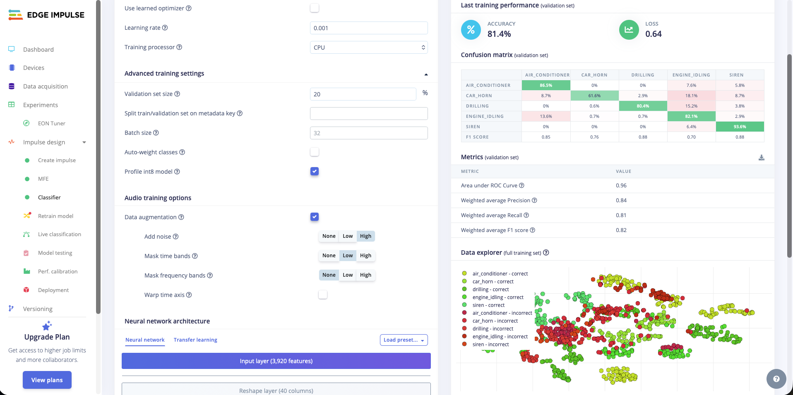
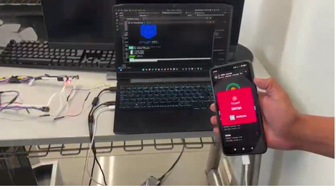

<h1 align="center"> Gadget para personas con discapacidad auditiva </h1>  

  
  

  Sistema wearable inteligente para detección de sonidos ambientales con retroalimentación háptica direccional,
  diseñado para personas con discapacidad auditiva.

  <strong>ESP32 • Edge Impulse • Audio I2S • BLE • Vibración direccional</strong>

---

## Table of Contents

- [Introduction](#introduction)
- [Features](#features)
- [System Architecture](#system-architecture)
- [Hardware Requirements](#hardware-requirements)
- [Software Stack](#software-stack)
- [Edge Impulse Model](#edge-impulse-model)
- [BLE Communication](#ble-communication)
- [Build & Flash](#build--flash)
- [Usage](#usage)
- [Future Improvements](#future-improvements)
- [Acknowledgments](#acknowledgments)

---

## Introduction

**Werable ayuda asistida para personas sin capacidad auditiva** es un proyecto de investigación y desarrollo que combina **Machine Learning embebido** y **hardware wearable**
para detectar sonidos críticos del entorno urbano y notificar al usuario mediante:

- Vibración izquierda / derecha / ambos lados
- Indicadores LED por nivel de riesgo
- Comunicación BLE hacia una aplicación móvil

El sistema utiliza un **modelo de clasificación de audio entrenado en Edge Impulse** basado en sonidos del dataset
*UrbanSound8K*, optimizado para correr en un **ESP32**.

---

## Features

Principales funcionalidades del sistema:

- 🎧 Captura de audio estéreo con **2 micrófonos INMP441 (I2S)**
- 🧠 Clasificación de sonidos con **Edge Impulse (int8 quantized)**
- 🚨 Detección de sonidos peligrosos (sirena, claxon)
- 📍 Detección de dirección del sonido (izquierda / derecha / centro)
- 🔴🟡🟢 Sistema de LEDs por nivel de riesgo
- 📳 Vibración direccional mediante motores hápticos
- 📲 Comunicación BLE con JSON ultra liviano (< 20 caracteres)
- 🔋 Optimización por RMS para ahorro de energía

---

## System Architecture
Micrófonos INMP441 (L/R)
↓
ESP32 (I2S Audio)
↓
RMS Thresholding
↓
Edge Impulse Inference
↓
Clasificación + Dirección
↓
┌───────────────┬──────────────┐
│ Vibración L/R │ LEDs de estado│
└───────────────┴──────────────┘
↓
BLE JSON
↓
App móvil

---

## Hardware Requirements

- ESP32 (WROOM / DevKit)
- 2 × Micrófonos **INMP441**
- 2 × Motores de vibración
- 3 × LEDs (verde, amarillo, rojo)
- Batería Li-ion / Li-Po
- Resistencias y cableado básico

---

## Software Stack

- **Framework:** Arduino
- **ML:** Edge Impulse (Audio Classification)
- **Comunicación:** BLE (NimBLE)
- **Audio:** I2S
- **Lenguaje:** C / C++
- **Modelo:** Quantized int8

---

## Edge Impulse Model

- Dataset base: **UrbanSound8K**
- Clases entrenadas:
  - `siren`
  - `car_horn`
  - `drilling`
  - `engine_idling`
  - `air_conditioner`
- Accuracy validación: **~81%**
- AUC ROC: **0.96**
- Optimizado para ejecución en ESP32

El modelo solo se activa cuando el RMS del audio supera un umbral mínimo,
reduciendo falsos positivos y consumo energético.

---

## BLE Communication

Ejemplo de mensaje BLE enviado a la aplicación móvil:

{"S":"Si","L":"Iz"}

## Build & Flash
1. Instalar Arduino IDE  
2. Agregar soporte para ESP32  
3. Instalar librerías necesarias:
   - NimBLE-Arduino
   - Edge Impulse SDK
4. Configurar pines I2S y BLE  
5. Compilar y flashear el ESP32
## Usage

1. Encender el dispositivo  
2. LED verde → ambiente silencioso  
3. LED amarillo → voz o ruido leve  
4. LED rojo → sonido peligroso detectado  
5. La vibración indica la dirección del sonido  
6. La aplicación móvil recibe eventos vía BLE
## Future Improvements

- Mejora de precisión para claxon lejano
- Detección de más clases de sonidos urbanos
- Aplicación móvil multiplataforma
- Optimización del consumo energético
- Diseño industrial del wearable
## Acknowledgments

- Edge Impulse Team
- UrbanSound8K Dataset
- Comunidad Open Source
- Investigación orientada a accesibilidad e inclusión

  <strong>Proyecto desarrollado por Alexis Jhair Villarruel , Deivis Guivar, Manuel Tenipuclla y Juan Alvarado </strong> 
  Ingeniería • IoT • Machine Learning embebido

